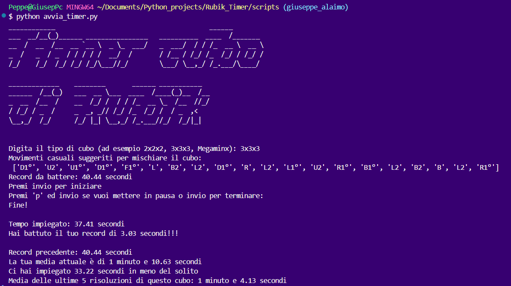
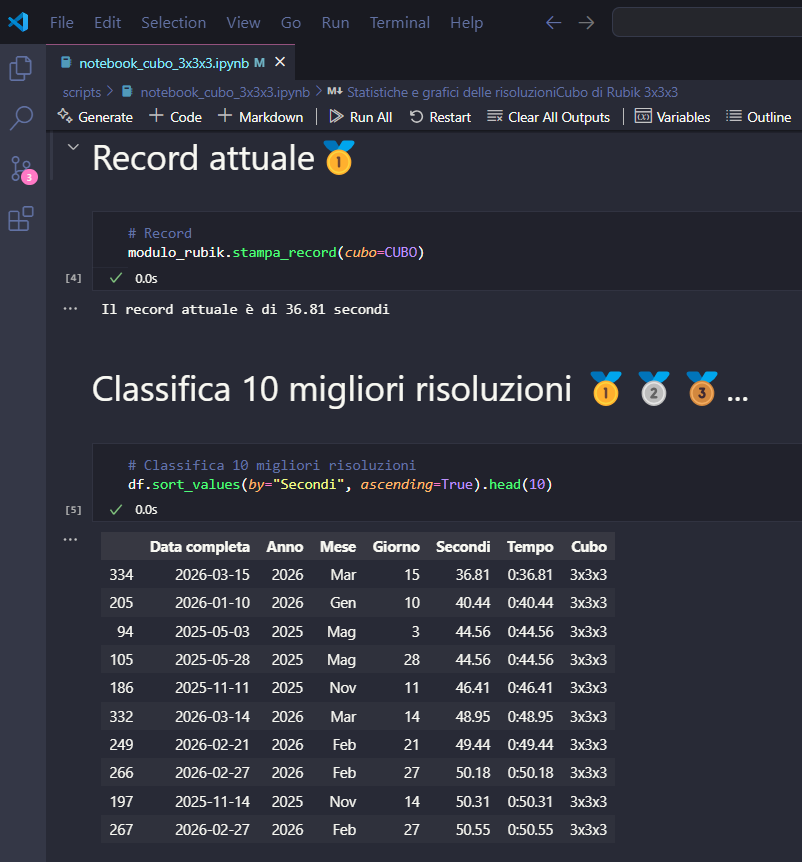
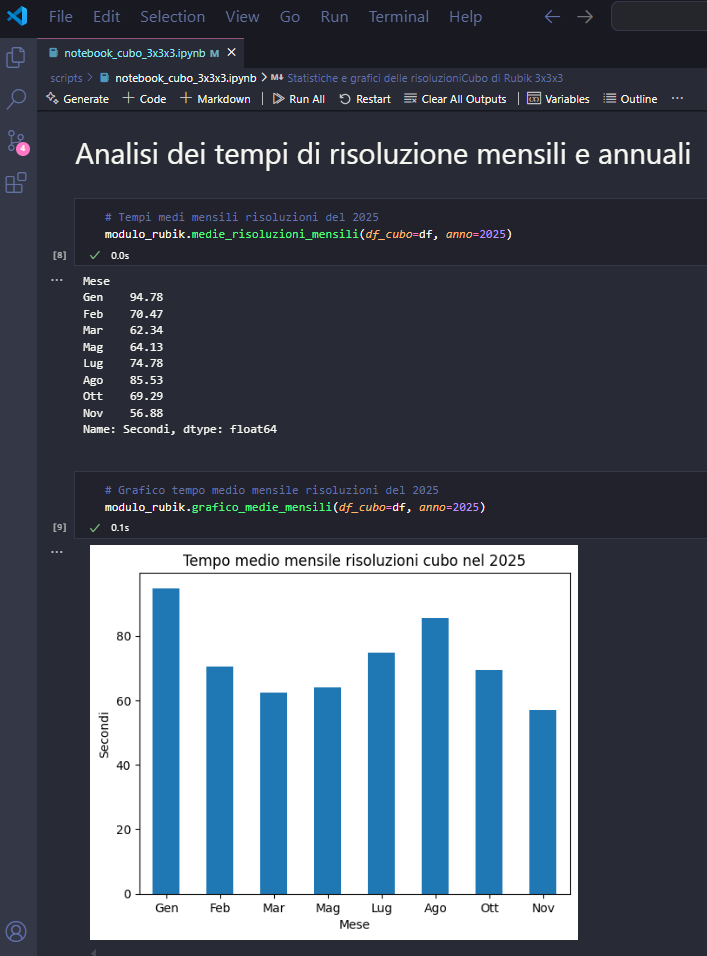

# Timer cubo di Rubik

Questo progetto contiene dei Notebook e diversi script scritti in Python progettati per registrare ed analizzare i tempi di risoluzione di diversi tipi di cubi di Rubik. Include funzionalità per registrare i tempi di risoluzione in tempo reale o caricare tempi di risoluzione manualmente, suggerire mosse per mescolare il cubo prima di iniziare a risolverlo, tenere traccia dei record personali e dei tempi medi di risoluzione e molto altro.
Ottimo per fare pratica e tenere traccia dei propri progressi.


## Struttura del Progetto

- **modulo_rubik.py**: Modulo Python contenente funzioni usate nei diversi script e notebook.
- **avvia_timer.py**: Script principale per avviare il timer e registrare i tempi di risoluzione.
- **carica_tempo.py**: Script per caricare i tempi salvati da un file CSV.
- **database.csv**: File CSV che memorizza i tempi di risoluzione.
- **notebook_generale**, **notebook_cubo_2x2x2**, **notebook_cubo_3x3x3** eccetera: Notebook Jupyter per analisi e visualizzazioni dei dati.


## Requisiti

- Python 3.x
- Moduli aggiuntivi specificati nel file `requirements.txt` installabili tramite il comando `python -m pip install -r requirements.txt` dal terminale.

## Come funziona
Per prima cosa bisogna andare nella cartella "scripts" con il seguente comando dal terminale:
`cd scripts` e poi eseguire uno dei comandi descritti sotto:
1. **Avviare il Timer**:
   Eseguire lo script `avvia_timer.py` per registrare i tempi di risoluzione:
   ```bash
   python avvia_timer.py
2. **Caricare i dati manualmente**:
    Eseguire lo script `carica_tempo.py` per caricare i tempi di risoluzione:
    ```bash
    python carica_tempo.py
3. **Eseguire i notebook**:
    Eseguire i notebook in un ambiente supportato (ad esempio tramite Jupyter Notebook https://jupyter.org/) dopo aver registrato o caricato diverse risoluzioni, per analizzare i propri dati sulle risoluzioni come tempi record, tempi medi di risoluzione ed altro grazie anche alla generazione di grafici.

## Licenza
Questo progetto è distribuito sotto la licenza MIT. Controllare il file <a href="LICENCE">LICENSE</a> per ulteriori informazioni.

## Contatti
Giuseppe Luca Alaimo gl.alaimo@protonmail.com

## Anteprima script avvia_timer.py


## Anteprima notebook_cubo_3x3x3.ipynb

