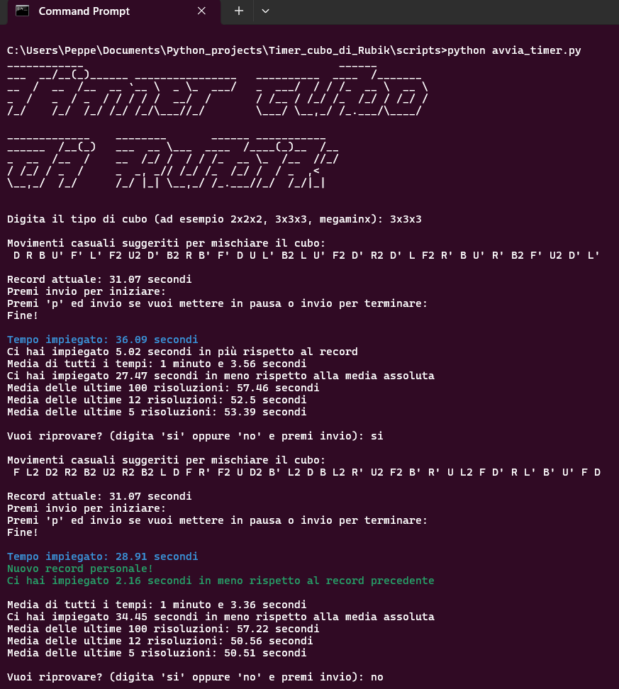
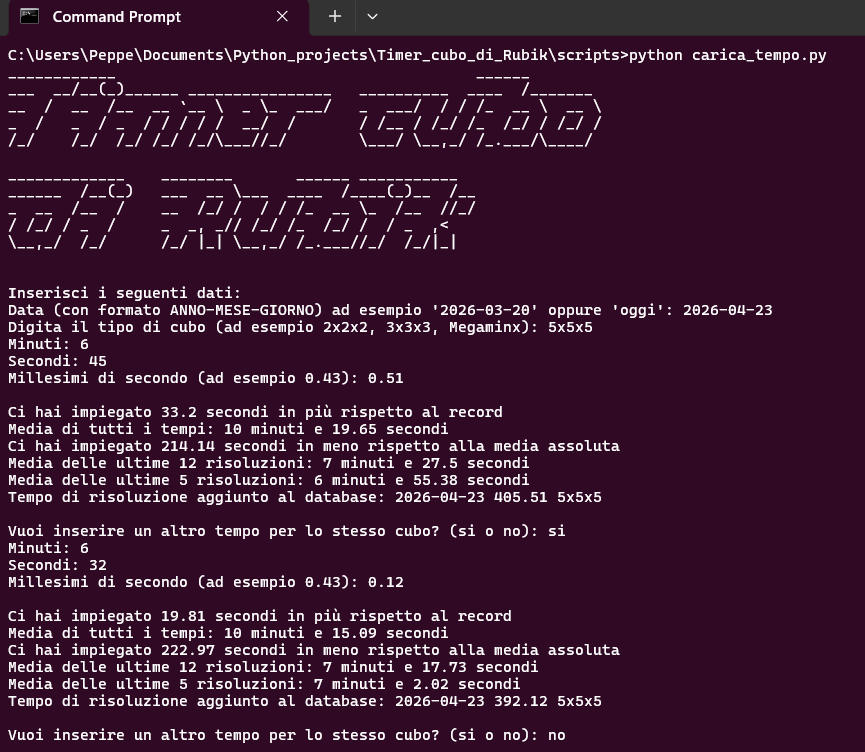
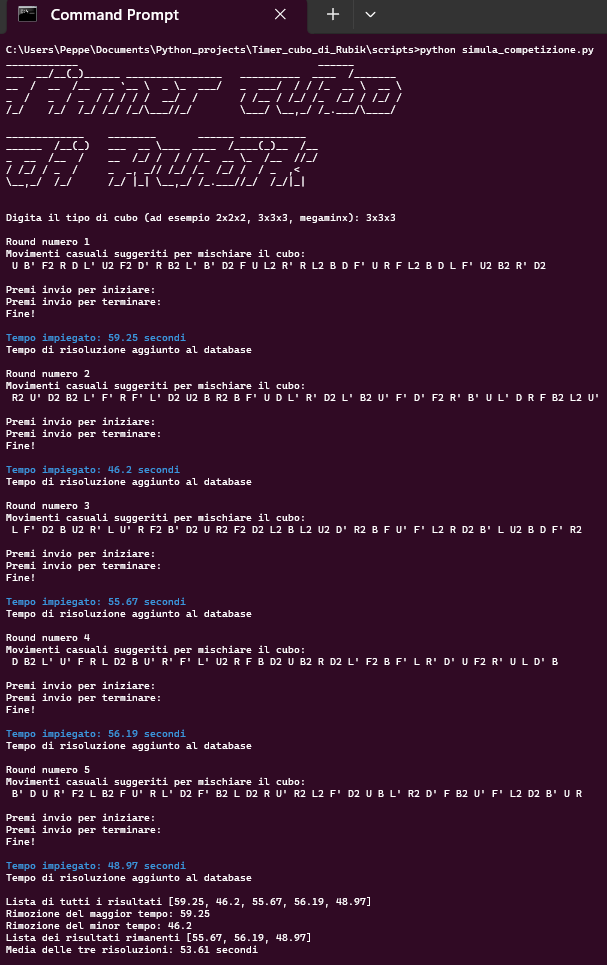
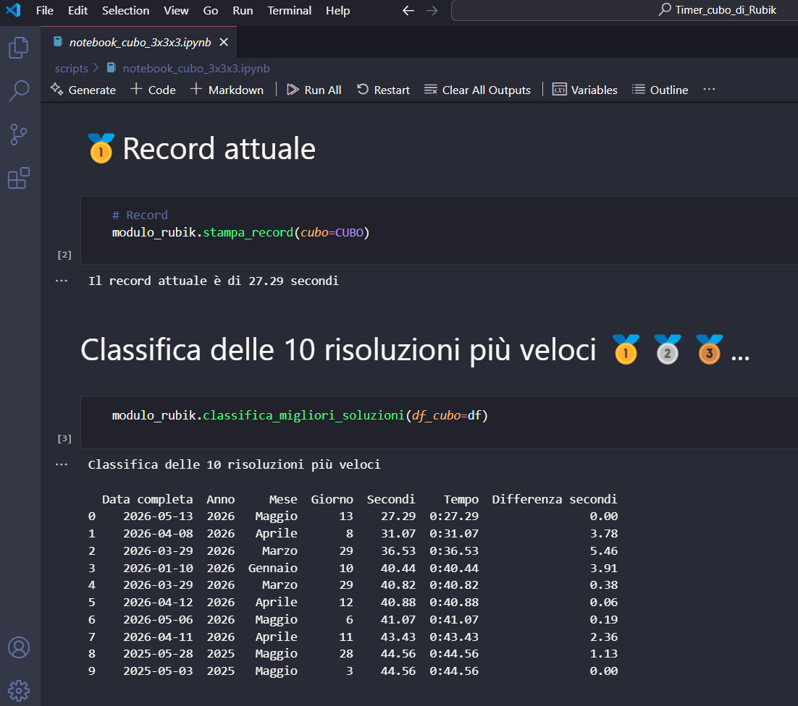
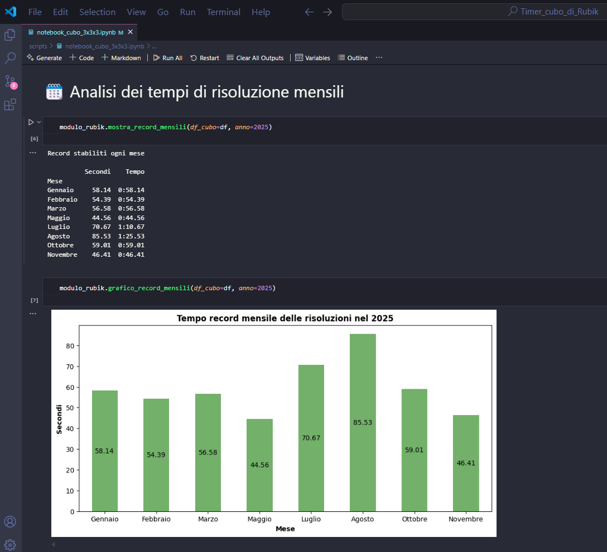
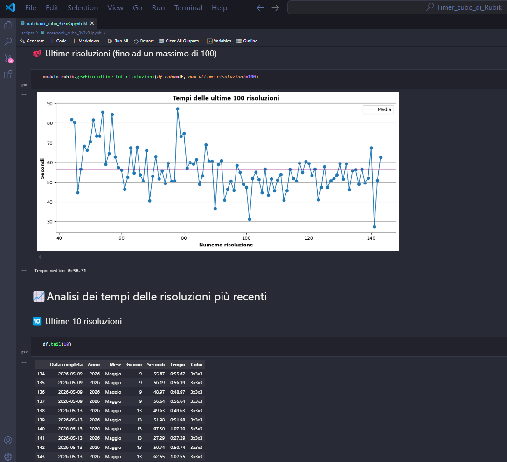
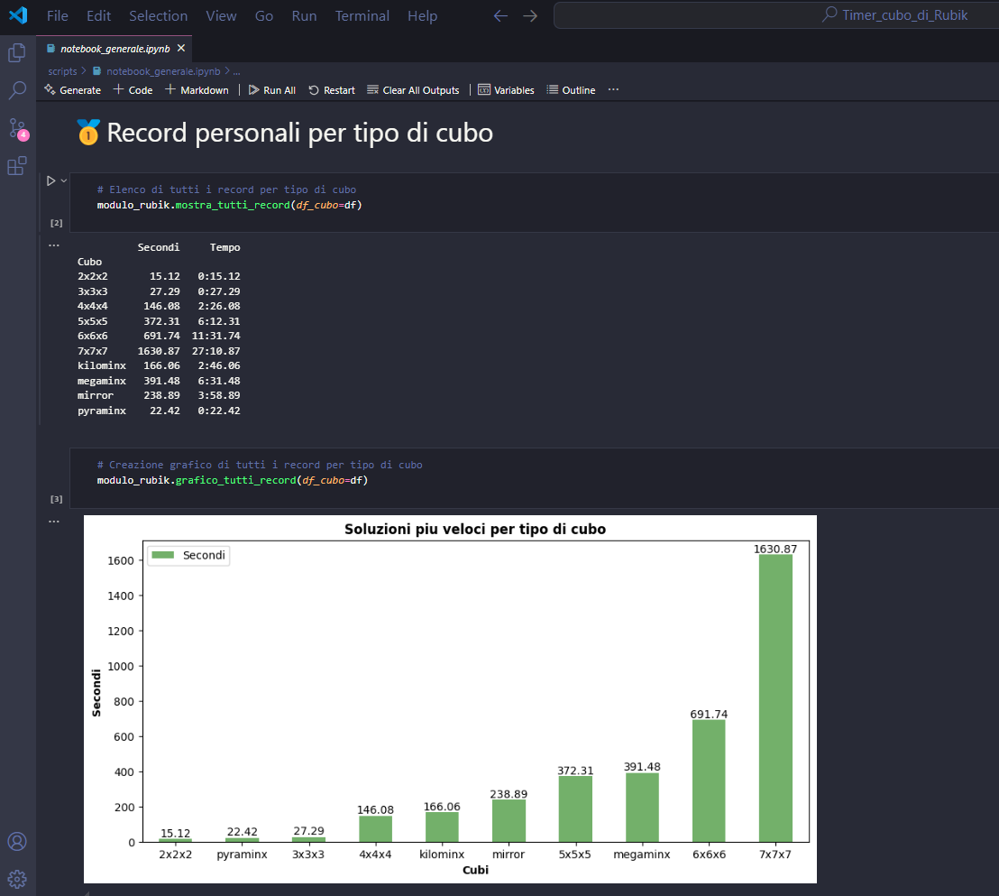

# Timer cubo di Rubik

Questo progetto contiene vari script scritti in Python progettati per registrare i tempi di risoluzione di molti tipi di cubi di Rubik in tempo reale, caricare tempi di risoluzione manualmente, suggerire mosse per mischiare il cubo prima di iniziare a risolverlo, simulare una competizione di speedcubing, tenere traccia dei record personali e dei tempi medi di risoluzione e molto altro. 
Questo progetto contiene inoltre vari Notebook per analizzare i dati relativi ai tempi di risoluzione grazie anche alla creazione di molti grafici ed al calcolo di varie statistiche. 
Ottimo per fare pratica e tenere traccia dei propri progressi.


## Struttura del Progetto

- **modulo_rubik.py**: Modulo Python contenente funzioni usate nei vari script e notebook.
- **avvia_timer.py**: Script principale per avviare il timer e registrare i tempi di risoluzione.
- **carica_tempo.py**: Script per caricare i tempi salvati da un file CSV.
- **simula_competizione.py**: Script per simulare una competizione di speedcubing.
- **database.csv**: File CSV che memorizza i tempi di risoluzione.
- **notebook_generale**, **notebook_cubo_2x2x2**, **notebook_cubo_3x3x3** eccetera: Notebook Jupyter per analisi e visualizzazioni dei dati.

Il branch `giuseppe_alaimo` contiene una versione di questo progetto con i dati e le statistiche delle risoluzioni dell'autore (Giuseppe Alaimo appunto) ed è in continuo aggiornamento. Potrebbe essere utile per dargli un'occhiata e farsi un'idea di come sono strutturati i notebook ed avere un'anteprima dettagliata del progetto prima di scaricarlo o clonarlo. (Ad esempio <a href="https://github.com/gl-alaimo/Timer_cubo_di_Rubik/blob/giuseppe_alaimo/scripts/notebook_cubo_3x3x3.ipynb">questo file notebook</a>)

## Requisiti

- Python 3.x
- Moduli aggiuntivi specificati nel file `requirements.txt` installabili tramite il comando `python -m pip install -r requirements.txt` dal terminale.

## Come funziona
Per prima cosa bisogna scaricare o clonare il progetto e poi andare nella cartella "scripts" con il seguente comando dal terminale di Windows:
`cd .\scripts\` (oppure `cd scripts` da un terminale di tipo bash) e poi eseguire uno dei comandi descritti sotto:
1. **Avviare il Timer**:
   Eseguire lo script `avvia_timer.py` per registrare i tempi di risoluzione in tempo reale.<br>
   Da un terminale Windows:
   ```
   python .\avvia_timer.py
   ```
   Da un terminale bash:
   ```
   python avvia_timer.py
2. **Caricare i dati manualmente**:
    Eseguire lo script `carica_tempo.py` per caricare i tempi di risoluzione registrati in passato.<br>
   Da un terminale Windows:
   ```
   python .\carica_tempo.py
   ```
   Da un terminale bash:
   ```
   python carica_tempo.py
3. **Simulare una competizione**:
    Eseguire lo script `simula_competizione.py` per simulare una competizione di speedcubing.<br>
   Da un terminale Windows:
   ```
   python .\simula_competizione.py
   ```
   Da un terminale bash:
   ```
   python simula_competizione.py
4. **Eseguire i notebook**:
    Eseguire i notebook in un ambiente supportato (ad esempio tramite Jupyter Notebook https://jupyter.org/ o con Visual Studio Code dopo aver installato l'estenzione dedicata https://marketplace.visualstudio.com/items?itemName=ms-toolsai.jupyter) dopo aver registrato o caricato varie risoluzioni, per analizzare i propri dati sulle risoluzioni come tempi record, tempi medi di risoluzione ed altro, grazie anche alla creazione di grafici.

## Licenza
Questo progetto è distribuito sotto la licenza MIT. Controllare il file <a href="LICENCE">LICENSE</a> per ulteriori informazioni.

## Contatti
Giuseppe Alaimo<br>
Email: <a href="gl.alaimo@protonmail.com">gl.alaimo@protonmail.com</a><br>
LinkedIn: <a href="https://www.linkedin.com/in/giuseppe-luca-alaimo-9875b32a1/">Link</a>

## Anteprima script avvia_timer.py


## Anteprima script carica_tempo.py


## Anteprima script simula_competizione.py


## Anteprima notebook_cubo_3x3x3.ipynb




## Anteprima notebook_generale.ipynb
