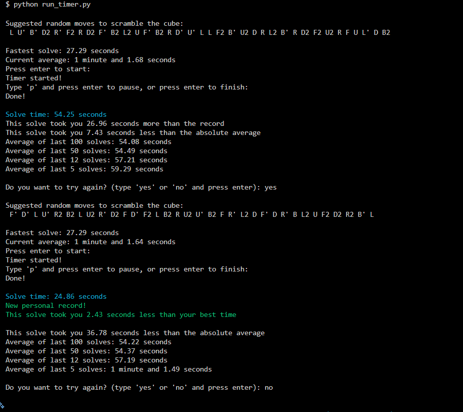
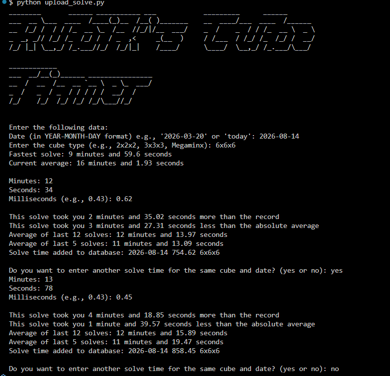
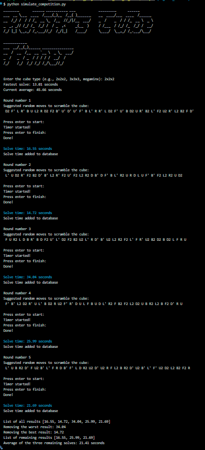
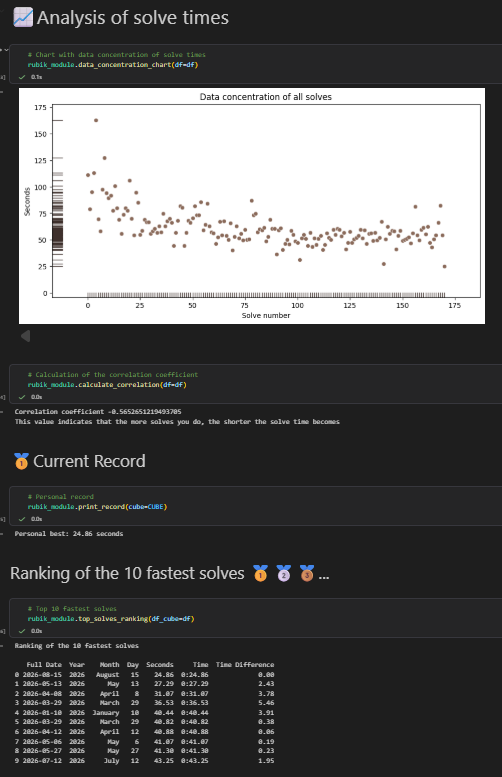
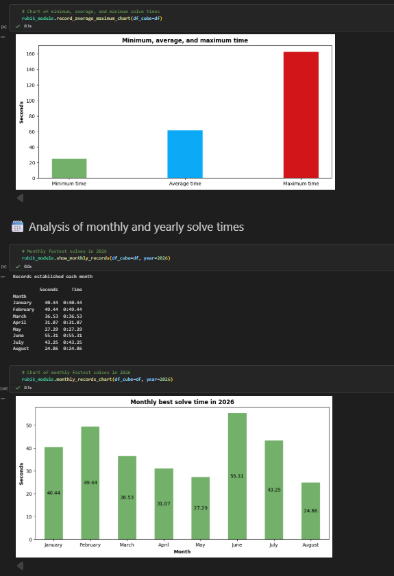
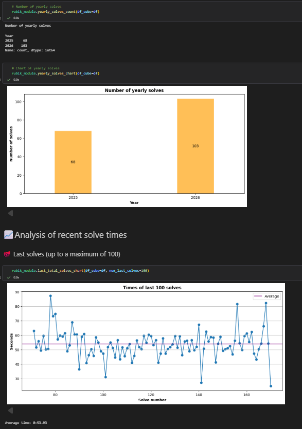
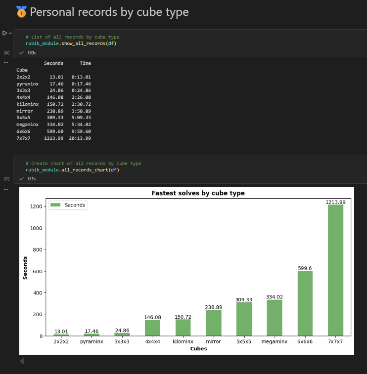
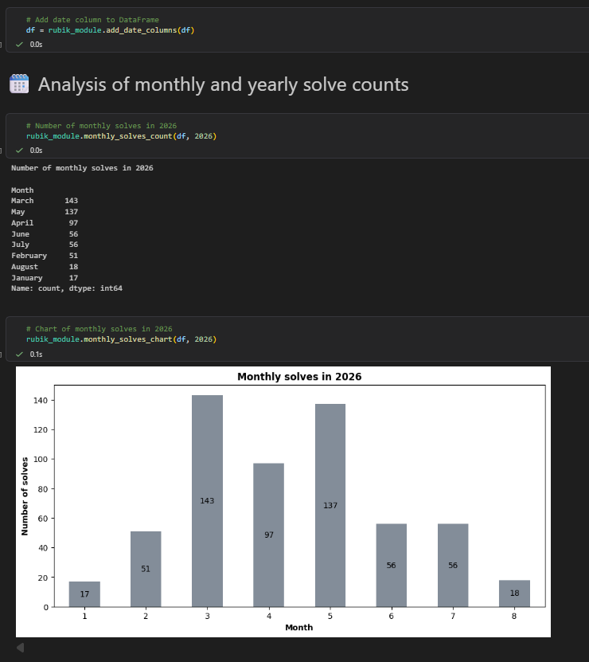

# Rubik's Cube Timer

This project contains <br>
- various Python scripts designed to track solve times for many types of Rubik's cubes in real-time, manually upload solve times, suggest moves to scramble the cube before starting to solve it, simulate a speedcubing competition, track personal records and average solve times, and much more.<br>
- various Jupyter Notebooks for analyzing data related to solve times through the creation of many charts and the calculation of various statistics.

Great for practicing and keeping track of your progress.


## Project Structure

- **rubik_module.py**: Python module containing functions used in various scripts and notebooks.
- **run_timer.py**: Main script to start the timer and record solve times.
- **upload_solve.py**: Script to manually upload solve times.
- **simulate_competition.py**: Script to simulate a speedcubing competition.
- **database.csv**: CSV file that stores solve times.
- **general_notebook**, **notebook_2x2x2**, **notebook_3x3x3** etc.: Jupyter Notebooks for data analysis and visualizations.

The `giuseppe_alaimo` branch contains a version of this project with data and statistics of the author's (Giuseppe Alaimo) solves and is continuously updated. It might be useful to take a look at it and get an idea of how the notebooks are structured and have a detailed preview of the project before downloading or cloning it. (For example, <a href="https://github.com/gl-alaimo/Timer_cubo_di_Rubik/blob/giuseppe_alaimo/scripts/notebook_cubo_3x3x3.ipynb">this notebook file</a>)

## Requirements
- Python 3.x downloadable from https://www.python.org/downloads/

## Installation
Run the following commands in the terminal:
- `git clone https://github.com/gl-alaimo/Timer_cubo_di_Rubik.git` or `git clone git@github.com:gl-alaimo/Timer_cubo_di_Rubik.git` to download the project from GitHub.com
- `cd Timer_cubo_di_Rubik` to open the project once downloaded
- `python -m venv venv` to create a virtual environment
- `source venv/bin/activate` (or `venv\Scripts\activate` on Windows) to activate the virtual environment
- `python -m pip install -r requirements.txt` to install additional modules


## How it Works
Once you have downloaded or cloned the project, go to the "scripts" folder with the following command from the Windows terminal:
`cd .\scripts_and_notebooks\` (or `cd scripts_and_notebooks` from a bash terminal) and then run one of the commands described below:

1. **Start the Timer**:
   Run the script `run_timer.py` to record solve times in real-time.<br>
   From a Windows terminal:
   ```
   python .\run_timer.py
   ```
   From a bash terminal:
   ```
   python run_timer.py
   ```

2. **Manually Upload Data**:
   Run the script `upload_solve.py` to upload solve times recorded in the past.<br>
   From a Windows terminal:
   ```
   python .\upload_solve.py
   ```
   From a bash terminal:
   ```
   python upload_solve.py
   ```

3. **Simulate a Competition**:
   Run the script `simulate_competition.py` to simulate a speedcubing competition.<br>
   From a Windows terminal:
   ```
   python .\simulate_competition.py
   ```
   From a bash terminal:
   ```
   python simulate_competition.py
   ```

4. **Run the Notebooks**:
   Run the notebooks in a supported environment (for example, via Jupyter Notebook https://jupyter.org/ or with Visual Studio Code after installing the dedicated extension https://marketplace.visualstudio.com/items?itemName=ms-toolsai.jupyter) after recording or uploading various solves, to analyze your solve data such as record times, average solve times, and more, thanks to the creation of charts.

## License
This project is distributed under the MIT license. Check the <a href="LICENCE">LICENSE</a> file for more information.

## Contacts
Giuseppe Alaimo<br>
Email: <a href="gl.alaimo@protonmail.com">gl.alaimo@protonmail.com</a><br>
LinkedIn: <a href="https://www.linkedin.com/in/giuseppe-luca-alaimo-9875b32a1/">Link</a>

## Preview of run_timer.py script


## Preview of upload_solve.py script


## Preview of simulate_competition.py script


## Preview of notebook_cubo_3x3x3.ipynb
<br>
<br>


## Preview of notebook_generale.ipynb


